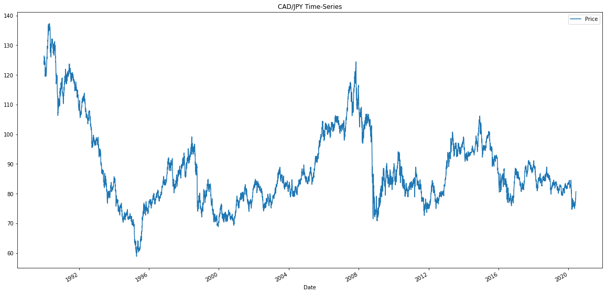
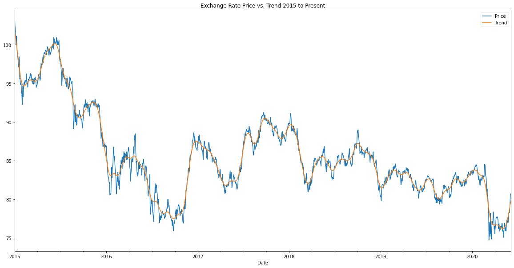
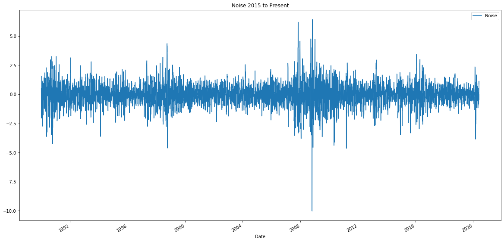
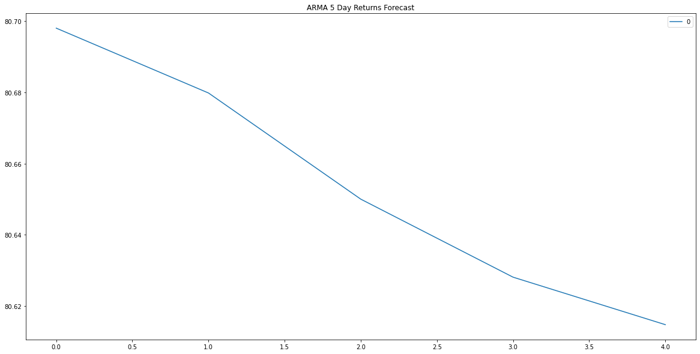
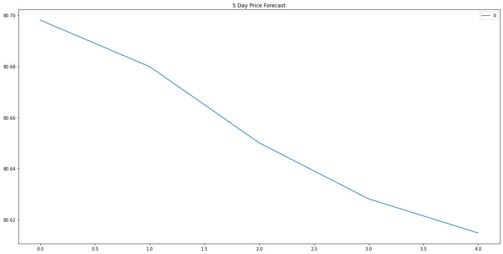
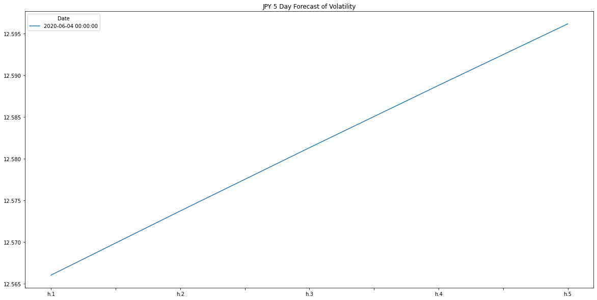
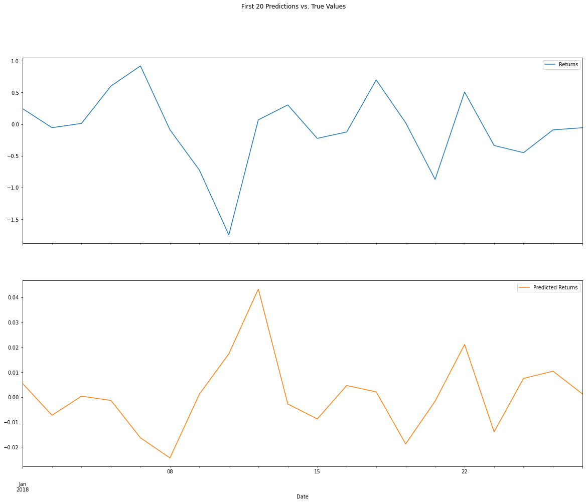

# Unit 10—A Yen for the Future - Summary

## Background

The financial departments of large companies often have to make foreign currency transactions when doing international business, while hedge funds are also interested in anything that will provide an edge in predicting currency movements. Hence, both are always eager to gain a better understanding of the future direction and risk of various currencies.  
  
# Time Series Analysis  
 
## Initial Time-Series Plotting  

Pre-1996 and the 2008 saw peaks CAD v. YEN strength. Due to degradation of CAD buying power during the time pre-1992-2021+ period, short term outlook points to a continuation of the trend.  

Longer term, where there are peak values pre-1992 and between 2007-2008 and deep downward trends in 1996 and 2009, much of the CAD/YEN relationship was stable.  
 
## Decomposition Using a Hodrick-Prescott Filter  

  
  

Using the HP filter reveals the overall Trend. Short Term seemingly there are 2 quarter uptrends that follow dips. Long term there is an overall downtrend.  
 
## Forecasting Returns using an ARMA Model  

  

Based on the p-value this model does not appear to be a good fit.  
 
## Forecasting the Exchange Rate Price using an ARIMA Model  

Based on the p-value this model does not appear to be a good fit and it forecasts a near term downward trend for JPY.  
 
## Volatility Forecasting with GARCH  

  

This model points to near term volatility. Depending on technique and risk appetite this indicates a period of large draw down/profit.  
  
# Regression Analysis  

## Linear Regression Model  

  

Having the lower RMSE, the out-of-Sample Root Mean Squared Error of 0.6445805658569028 outperformed the In-Sample Root Mean Squared Error of 0.841994632894117.