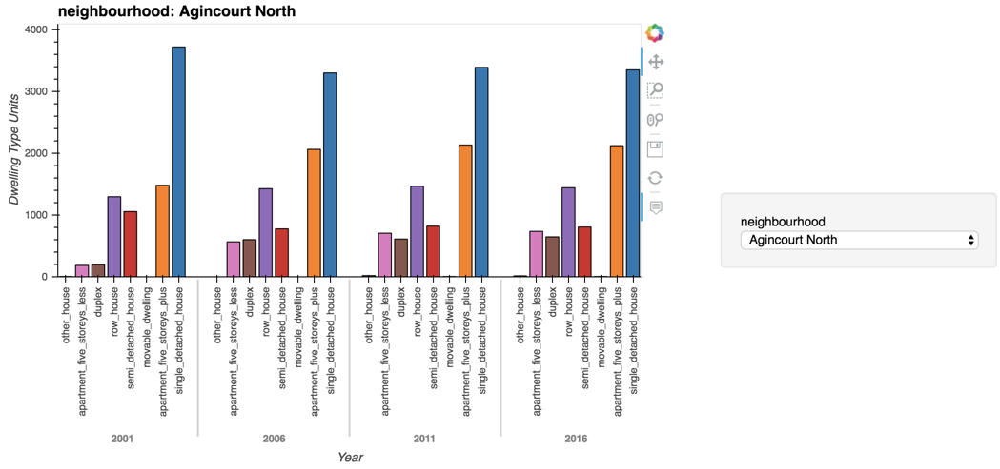

# Unit 6 - Pythonic Monopoly

*[Photo by James Wheeler](https://www.pexels.com/@souvenirpixels?utm_content=attributionCopyText&utm_medium=referral&utm_source=pexels) | [Free License](https://www.pexels.com/photo-license/)*

## Background

Harold's company has just started a new Real Estate Investment division to provide customers with a broader range of portfolio options. Harold was tasked with building a prototype dashboard, and he needs your help. The real estate team wants to trial this initial offering with investment opportunities for the Toronto market. If the new service is popular, then they can start to expand to other markets.

This dashboard's goal is to provide charts, maps, and interactive visualizations that help customers explore the data and determine if they want to invest in rental properties in Toronto.

In this homework assignment, you will help Harold accomplish the following tasks:

1. [Complete a notebook of rental analysis](#Rental-Analysis)

2. [Create a dashboard of interactive visualizations to explore the market data](#Dashboard)

The data provided for this homework was retrieved from the following websites:

* [Toronto Open Data](https://open.toronto.ca/)

* [Census Profile, 2016 Census - Toronto Metropolitan Area, Ontario and Canada](https://www12.statcan.gc.ca/census-recensement/2016/dp-pd/prof/details/page.cfm?Lang=E&Geo1=CMACA&Code1=535&Geo2=PR&Code2=01&SearchText=toronto&SearchType=Begins&SearchPR=01&B1=All&TABID=1&type=0)

**Note:** If you encounter technical difficulties using PyViz, refer to the troubleshooting section of the [PyViz Installation Guide](PyVizInstallationGuide.md).

---

## Files

* [toronto_neighbourhoods_census_data.csv](Starter_Code/Data/toronto_neighbourhoods_census_data.csv)

* [toronto_neighbourhoods_coordinates.csv](Starter_Code/Data/toronto_neighbourhoods_coordinates.csv)

* [Rental Analysis Starter Jupyter Notebook](Starter_Code/rental_analysis.ipynb)

* [Dashboard Starter Jupyter Notebook](Starter_Code/dashboard.ipynb)

## Instructions

### Rental Analysis

The first step to building the dashboard is to work out all of the calculations and visualizations in an analysis notebook. Once the code is running properly, it can be copied over to a dashboard code and used with Panel to create the final layout. Use the `rental_analysis.ipynb` to complete the following:

#### Dwelling Types Per Year

In this section, you will calculate the number of dwelling types per year and visualize the results as a bar chart using the Pandas plot function.

**Note:** By default, the colour of the bar charts is blue. However, it is hard to see the difference between the yearly data.

As an optional challenge, you can manually use the `color` parameter of the `plot()` function to change the colour of each bar chart.

| Default Bar Charts                                  | Colored Bar Charts                                   |
------------------------------------------------------|------------------------------------------------------|
| |  |

#### Average Monthly Shelter Costs in Toronto Per Year

In this section, you want to visualize the average monthly shelter costs per year to understand rental income trends over time better. You will visualize the average (mean) shelter cost for owned and rented dwellings per year and visualize it as line charts.

As an optional challenge, you can plot each line chart in a different colour.

1. Calculate the average monthly shelter costs for owned and rented dwellings for each year.

2. Visualize the monthly shelter costs per year as line charts.

    

#### Average House Value per Year

In this section, you want to determine the average house value per year. An investor may want to better understand the sales price of the rental property over time. For example, a customer will want to know if they should expect an increase or decrease in the property value over time so they can determine how long to hold the rental property. You will visualize the `average_house_value` per year as a bar chart.

1. Calculate the mean `average_house_value` for each year.

2. Visualize the `average_house_value` per year as a line chart.

  

#### Average Prices By Neighbourhood

In this section, you want to compare the house value by neighbourhood.

1. Create a new DataFrame with the mean house values by neighbourhood per year.

2. Visualize the mean `average_house_value` per year with the neighbourhood as a dropdown selector.

**Hint:** Use `hvplot` to obtain the interactive dropdown selector for the neighbourhood.

  

#### Number of Dwelling Types per Year

In this section, you want to visualize the number of dwelling types per year in each neighbourhood. You want to provide investors a tool to understand the evolution of dwelling types over the years.

**Hint:** Use `hvplot` to create an interactive visualization of the average number of dwelling types per year with a dropdown selector for the neighbourhood.

#### Top 10 Most Expensive Neighbourhoods

In this section, you want to figure out which neighbourhoods are the most expensive. You will need to calculate the mean house value for each neighbourhood and then sort the values to obtain the top 10 most expensive neighbourhoods on average. Plot the results as a bar chart.

#### Neighbourhood Map

In this final section, you will read in neighbourhood location data and build an interactive map with the average prices per neighbourhood. Use a scatter Mapbox object from Plotly express to create the visualization. You will need your Mapbox API key for this.

Remember that to create maps visualizations using Plotly Express, you will need to create an account at [mapbox](https://www.mapbox.com/) and [create an access token](https://docs.mapbox.com/help/how-mapbox-works/access-tokens/#creating-and-managing-access-tokens).

  

#### Cost Analysis (Optional Challenge)

Plotly express offers a broad selection of interactive plots. In this optional challenge section, you will use Plotly express to create a couple of plots that investors can interactively filter and explore various factors related to the house value of Toronto's neighbourhoods.

1. Create a bar chart row facet to plot the average house values for all Toronto neighbourhoods per year.

    **Hint:** You can learn more about facet plots in Plotly Express in [this link](https://plotly.com/python/facet-plots/).

   

2. Create a sunburst chart to conduct a cost analysis of the most expensive neighbourhoods in Toronto per year.

    **Hint:** You can learn more about sunburst charts in Plotly Express in [this link](https://plotly.com/python/sunburst-charts/).

    

### Dashboard

Now that you have worked out all of the code and analysis, you will use the Panel library to build an interactive dashboard for all of the visualizations. There are no hard requirements for the layout of this dashboard, so use your imagination and creativity!

Use the `dashboard.ipynb` starter notebook for your dashboard code. Copy over the code for each visualization and place this into separate functions (1 function per visualization). This will make it easier to build and modify the layout later. Each function should return the plot figure in a format that Panel can use to plot the visualization.

Sample Dashboard:

  

---

### Submission

Disclose
  

* Upload two separate notebooks to Github - One for the analysis and one for the dashboard.

* Write a README file to explain how to run and use your dashboard.

* Submit the Github URL repository to Bootcampspot.

* **Important Note:** You should not submit your Mapbox access token to Github!

  

---

### Requirements

Disclose
  

#### Rental Analysis  (5 points)

##### To receive all points, your code must:

* Calculate the number of housing units per year. (2 points)
* Create a bar chart visualization of the rental analysis results. (3 points)

#### Average Monthly Shelter Costs in Toronto Per Year (10 points)

##### To receive all points, your code must:

* Calculate the average monthly shelter costs for owned and rented dwellings per year. (5 points)
* Generate line plots to show monthly shelter costs for owned and rented dwellings per year. (5 points)

#### Average House Value per Year (10 points)

##### To receive all points, your code must:

* Calculate the `average_house_value` for each year. (5 points)
* Generate a line plot using hvPlot to show the `average_house_value` per year. (5 points)

#### Average House Value by Neighbourhood (10 points)

##### To receive all points, your code must:

* Create a dataFrame with the mean house values by neighbourhood per year. (5 points)
* Create a visualization using hvPlot to show the `average_house_value` mean per year, adding a neighbourhood dropdown selector option. (5 points)

#### Number of Dwelling Types per Year (10 points)

##### To receive all points, your code must:

* Use hvPlot to generate a bar chart that compares the average number of dwelling types side by side. (5 points)
* Add a neighbourhood dropdown selector option using hvPlot. (5 points)

#### Top 10 Most Expensive Neighbourhoods (10 points)

##### To receive all points, your code must:

* Create a DataFrame with mean house values by neighbourhood. (5 points)
* Visualize the `average_house_value` per year and add a neighbourhood drop down selector. (5 points)

#### Neighbourhood Map (10 points)

##### To receive all points, your code must:

* Create a DataFrame joining the neighbourhood location data with the average home values data. (5 points)
* Generate an interactive map with average prices per neighbourhood. (5 points)

#### Interactive Toronto Dwellings Analysis Dashboard (5 points)

##### To receive all points, your code must:

* Compile the visualizations from the previous analysis into functions to create a Panel dashboard. (5 points)

#### Optional Bonus - Cost Analysis (30 points)

##### To receive all bonus points, your code must:

* Create a bar chart row facet to plot the average house values for all of Toronto's neighbourhoods per year. (10 points)
* Create a sunburst chart to conduct a cost analysis of the most expensive neighbourhoods in Toronto per year. (10 points)

#### Coding Conventions and Formatting (10 points)

##### To receive all points, your code must:

* Place imports at the beginning of the file, just after any module comments and docstrings and before module globals and constants. (3 points)
* Name functions and variables with lowercase characters and with words separated by underscores. (2 points)
* Follow Don't Repeat Yourself (DRY) principles by creating maintainable and reusable code. (3 points)
* Use concise logic and creative engineering where possible. (2 points)

#### Deployment and Submission (10 points)

##### To receive all points, you must:

* Submit a link to a GitHub repository that’s cloned to your local machine and contains your files. (5 points)
* Include appropriate commit messages in your files. (5 points)

#### Code Comments (10 points)

##### To receive all points, your code must:

* Be well commented with concise, relevant notes that other developers can understand. (10 points)

---

## References

Disclose
  

#### Listing  

<a id="ref001">1</a> hvPlot: Plotting. Retrieved from [hvplot.holoviz.org](https://hvplot.holoviz.org/user_guide/Plotting.html).

<a id="ref003">3</a>hvplot: Pandas API. Retrieved from [hvplot.holoviz.org](https://hvplot.holoviz.org/user_guide/Pandas_API.html).

<a id="ref004">4</a> Riley, Andrew (2020-06-10). Advanced Data Visualization in Python with HoloViews. Retrieved from [towardsdatascience.com](https://towardsdatascience.com/advanced-data-visualization-with-holoviews-e7263ad202e).

<a id="ref008">8</a> Zickert, Frank (2018-10-19). Check And Count Missing Values In Pandas Python. Retrieved from [DataScience Made Simple](https://www.datasciencemadesimple.com/check-count-missing-values-pandas-python-2/).

<a id="ref009">9</a> API Reference: pandas.Series.dropna. Retrieved from [pandas.pydata.org](https://pandas.pydata.org/pandas-docs/stable/reference/api/pandas.Series.dropna.html#pandas.Series.dropna).

<a id="ref010">10</a> User Guide: Working with missing data. Retrieved from [pandas.pydata.org](https://pandas.pydata.org/pandas-docs/stable/user_guide/missing_data.html#dropping-axis-labels-with-missing-data-dropna).

<a id="ref011">11</a> (2021-07-16). How to Check the Data Type in Pandas DataFrame. Retrieved from [Data To Fish](https://datatofish.com/data-type-pandas-dataframe/).

---

## Supplemental

Disclose
  

#### Note  

<a id="ref100">100</a> Jeffares, Alan (2021-10-14). From Jupyter Notebook to Deployment — A Straightforward Example. Retrieved from [calpaterson.com](https://towardsdatascience.com/from-jupyter-notebook-to-deployment-a-straightforward-example-1838c203a437).

<a id="ref101">101</a> Paterson, Cal (2021-11). An oral history of Bank Python. Retrieved from [github.com](https://calpaterson.com/bank-python.html?utm_medium=email&utm_source=topic+optin&utm_campaign=awareness&utm_content=20211120+prog+nl&mkt_tok=MTA3LUZNUy0wNzAAAAGA2x597x706_jpj_dfLoTer2j_lb7p7OBPqK-oS8pvtoOSr7OU6hpjs-qAaB-0rd4HE4RIsy286eNTnKU-5dHMt-myUCU2ZFTXBPleVsfRtwVNgg).

<a id="ref102">102</a> (2020-07-09). How to Remove Untracked Files in Git. Retrieved from [linuxize.com](https://linuxize.com/post/how-to-remove-untracked-files-in-git/).

<a id="ref103">103</a> (2022-02-09). Deleting a stash in Git. Retrieved from [tempertemper.net](https://www.tempertemper.net/blog/deleting-a-stash-in-git).

<a id="ref104">105</a> Mackie, Jasen (2022-12-17). re.: plot render native Matplotlib in Pandas vs. HVPlot. Retrieved from [utorvirtfinpt-i0c8572.slack.com](https://app.slack.com/client/T02JB3V1X6V/C02HRPXPTNJ/thread/D02M2JKT6B0-1639582349.056500).

<blockquote style="border-left: 0px solid #ccc; color: rgb(88, 166, 255);">

Disclose 105

So, people are asking about how to build a plot function that outputs a plot like the ones in the homework assignment. The answer is to call matplotlib natively, instead of pandas plot using df.plot. However, the homework says "using the Pandas plot function." So i am confused, but i dont see how it matters. If your plot uses matplotlib and looks like the plot in the homework then happy days. Now, have we used matplotlib natively to date? Not really. You can refer to these examples for some ideas on how to build matplotlib plots, including subplots and their various configurations - https://matplotlib.org/stable/tutorials/introductory/pyplot.html.
Start simple...build a plot first...then worry about making it a function which is fairly trivial. You can view the start of office hours today (before and at the end of class) for some ideas. Good luck!

PS - why does df.plot in pandas yield a different looking bar plot than calling matplotlib when calling df.plot uses matplotlib under the hood? Not sure...but there will be some transformation that pandas is doing that does not translate to how the plot is called when using matplotlib natively.
</blockquote>

<a id="ref106">106</a> SQL Tutorial. Retrieved from [w3schools.com](https://www.w3schools.com/sql/default.asp).

---

© 2021 Trilogy Education Services, a 2U, Inc. brand. All Rights Reserved.
